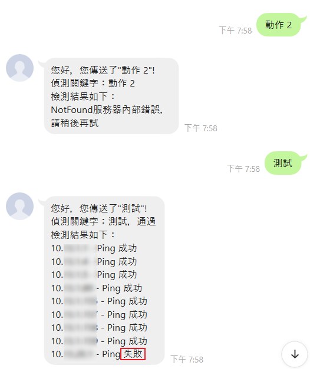
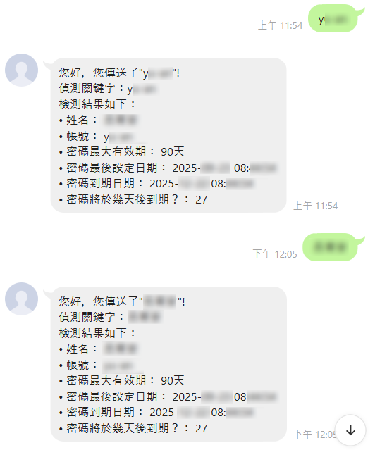

# LINE Bot Message API

這是一個 .NET 8.0 開發的 LINE Bot 訊息管理系統。**主要功能為接收並處理來自 LINE 平台的 Webhook 事件**，並根據使用者訊息做出相應回覆。此外也提供廣播訊息發送以及圖文選單（Rich Menu）管理功能。

## 📋 目錄

- [功能特色](#功能特色)
- [技術堆疊](#技術堆疊)
- [專案結構](#專案結構)
- [環境需求](#環境需求)
- [安裝與設定](#安裝與設定)
- [API 文件](#api-文件)
- [使用範例](#使用範例)
- [開發指南](#開發指南)

## ✨ 功能特色

### 核心功能（主要使用）
- **🎯 Webhook 事件處理**：接收並處理來自 LINE 平台的 Webhook 事件，根據使用者傳送的訊息關鍵字，自動回覆對應的資訊。
- **多種訊息類型支援**：文字、圖片、影片、位置等多種訊息格式

### 其他功能
- **廣播訊息**：向所有已加入好友的使用者發送訊息
- **Rich Menu（圖文選單）管理**：
    - 驗證圖文選單設定
    - 建立新的圖文選單
    - 取得圖文選單列表
    - 上傳圖文選單圖片
    - 設定預設圖文選單
- **伺服器健康檢查**：內建伺服器狀態監控服務
- **日誌記錄**：使用 Serilog 記錄系統運作狀態

## 🛠️ 技術堆疊

- **框架**：.NET 8.0
- **API 文件**：Swagger
- **日誌系統**：Serilog

## 📁 專案結構

```
LineBotMessage/
├── Controllers/              # API 控制器
│   └── LineBotController.cs  # LINE Bot 相關 API 端點
├── Domain/                   # 服務
│   ├── LineBotService.cs     # LINE Bot 核心服務
│   ├── RichMenuService.cs    # 圖文選單服務
│   └── ServerCheckService.cs # 伺服器檢查服務
├── Dtos/                     # 資料傳輸物件
│   ├── Messages/             # 訊息相關 DTO
│   ├── Richmenu/             # 圖文選單 DTO
│   └── Webhook/              # Webhook 事件 DTO
├── Enum/                     # 列舉定義
├── Providers/                # 提供者
│   └── JsonProvider.cs       # JSON 處理工具
├── Logs/                     # 日誌檔案目錄
├── image/                    # 圖片資源
├── appsettings.json          # 應用程式設定
├── appsettings.Development.json  
└── Program.cs                # 程式進入點
```

## ⚙️ 安裝與設定

### 1. 複製專案

```bash
git clone <repository-url>
cd LineBotMessage
```

### 2. 設定 LINE Bot 憑證

在 `appsettings.json` 或使用 User Secrets 設定以下參數：

```json
{
  "LineBot": {
    "ChannelAccessToken": "你的 Channel Access Token",
    "ChannelSecret": "你的 Channel Secret"
  }
}
```

> ⚠️ **注意**：建議使用 User Secrets 儲存敏感資訊，避免將金鑰提交至版本控制系統。

### 3. 使用 User Secrets（建議）

```bash
dotnet user-secrets set "LineBot:ChannelAccessToken" "你的 Channel Access Token"
dotnet user-secrets set "LineBot:ChannelSecret" "你的 Channel Secret"
```

### 4. 還原相依套件

```bash
dotnet restore
```

### 5. 執行專案

```bash
dotnet run
```

預設會在 `https://localhost:5001` 或 `http://localhost:5000` 啟動。

## 📖 API 文件

啟動專案後，可透過以下網址查看 Swagger API 文件：

```
https://localhost:5001/swagger
```

### 主要 API 端點

#### Webhook 事件接收 🎯（主要使用）
```http
POST /api/LineBot/Webhook
```
**這是本系統的核心 API 端點**，用於接收來自 LINE 平台的 Webhook 事件。當使用者在 LINE 中傳送訊息時，LINE 平台會將事件推送到此端點，系統會根據訊息內容進行處理並自動回覆。

> 💡 **提示**：需在 LINE Developers Console 中設定此 Webhook URL。

#### 廣播訊息
```http
POST /api/LineBot/SendMessage/Broadcast?messageType={messageType}
```

**範例請求**：
```json
{
  "Messages": [
    {
      "Type": "text",
      "Text": "廣播測試訊息"
    }
  ]
}
```

#### Rich Menu API

- **驗證圖文選單**
  ```http
  POST /api/LineBot/RichMenu/Validate
  ```

- **建立圖文選單**
  ```http
  POST /api/LineBot/RichMenu/Create
  ```

- **取得圖文選單列表**
  ```http
  GET /api/LineBot/RichMenu/GetList
  ```

- **上傳圖文選單圖片**
  ```http
  POST /api/LineBot/RichMenu/UploadImage/{richMenuId}
  ```

- **設定預設圖文選單**
  ```http
  GET /api/LineBot/RichMenu/SetDefault/{richMenuId}
  ```

## 📱 使用範例

以下是 LINE Bot 實際運作的對話截圖：

### 伺服器健康檢查功能

Bot 可以接收關鍵字並執行伺服器健康檢查，回傳詳細的檢測結果：



### 其他功能展示

Bot 支援多種自訂功能，可根據不同關鍵字回應相應的資訊：



## 👨‍💻 開發指南

### 相依性注入（DI）

本專案使用 .NET 內建的 DI 容器。所有服務都在 `Program.cs` 中註冊，並透過建構函式注入到控制器中。

**範例**：
```csharp
public LineBotController(
    LineBotService lineBotService,
    RichMenuService richMenuService,
    ServerCheckService serverCheckService,
    HttpClient httpClient,
    ILogger<LineBotController> logger)
{
    _lineBotService = lineBotService;
    _richMenuService = richMenuService;
    _serverCheckService = serverCheckService;
    _httpClient = httpClient;
    _logger = logger;
}
```

### 訊息處理流程

1. LINE 平台發送 Webhook 事件到你的伺服器
2. `LineBotController.Webhook` 接收事件
3. `LineBotService.ReceiveWebhook` 處理事件內容
4. 依據事件類型執行對應的邏輯
5. 透過 `ReplyMessage` 回覆使用者

### 新增訊息類型

1. 在 `Dtos/Messages` 目錄下建立對應的 DTO
2. 在 `Enum` 目錄下定義訊息類型列舉
3. 在 `LineBotService` 中實作處理邏輯
4. 在 `LineBotController` 中新增對應的 API 端點

### 日誌設定

在 `appsettings.json` 中可調整日誌等級和輸出格式：

```json
{
  "Serilog": {
    "MinimumLevel": {
      "Default": "Information",
      "Override": {
        "Microsoft": "Warning",
        "System": "Warning"
      }
    }
  }
}
```

## 🔐 安全性注意事項

> [!CAUTION]
> **請勿將以下敏感資訊提交至版本控制系統**：
> - LINE Channel Access Token
> - LINE Channel Secret
> - 任何其他 API 金鑰或密碼

建議使用以下方式管理敏感資訊：
1. 使用 User Secrets（開發環境）
2. 使用環境變數（生產環境）
3. 使用 Azure Key Vault 或其他金鑰管理服務

## 📄 授權

本專案僅供學習使用。

---